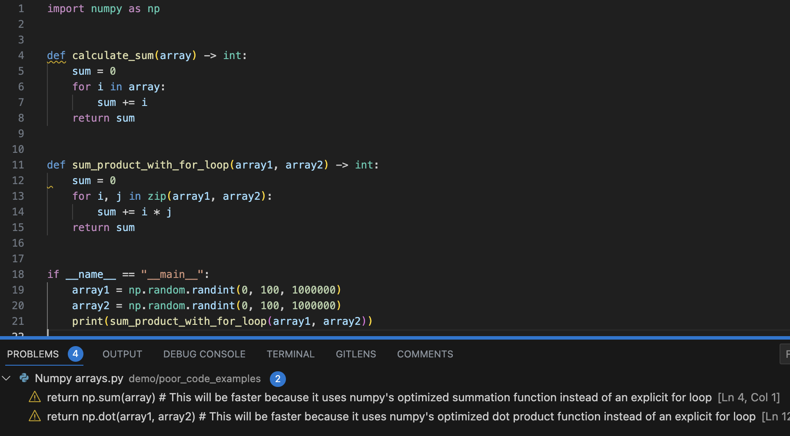

# Vertex Code Analysis

This is a **static code analysis** tool based on Google PaLM. Try our [web demo](https://vertex-code-analysis.streamlit.app/).

We built an IDE extension, so that you can improve your code without referring to a language model explicitly.




## VSCode recipe

### Preparation

In order to run this in your IDE, you need to get credentials from Goodle Cloud Vertex AI. Please check their [documentation](https://cloud.google.com/vertex-ai).

Once you get a credentials JSON file, clone this repository, and put the file inside it.

```shell
git clone https://github.com/romech/vertex-code-analysis.git
```

Next, create and activate your Python environment. After that, install this module:

```shell
cd vertex-code-analysis
pip install -e .
```

Verify it works:

```python
vertex_analyse path/to/some/code.py
```

It should print a few lines of code improvement suggestions.

### Adding to VSCode

1. Copy [.vscode/tasks.json](.vscode/tasks.json) to your workspace.
2. Replace `command` with your Python executable. You can find it by running `which python`.
3. Open Keyboard Shortcuts JSON, add the following item:
    ```json
    {
        "key": "cmd+h",
        "command": "workbench.action.tasks.runTask",
        "when": "editorTextFocus",
        "args": "Vertex Code Analysis"
    }
    ```

4. That's it!

## Notes

The language model that we're using here (`chat-bison`) seems not really suitable for real use, because it does not provide sufficient quality. Maybe larger models would be appropriate, but at the moment we do not have access to anything else.

This project was developed during an event ["Google Cloud Vertex AI Hackathon"](https://lablab.ai/event/google-vertex-ai-hackathon), by [Roman](https://github.com/romech) and [Dainius](https://github.com/DainiusSaltenis).
